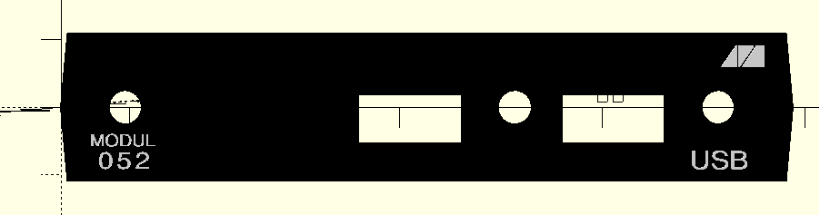

# Modulfrontblende für das Modul M052
Herstellungsverfahren: 3D-Druck

Achtung, vom Modul M052 gibt es mehrere Varianten!

## Konstruktion
Grundlegende Zeichnung in KiCad:

## Extrudieren
Export der Ebenen (Körper und Schrift) als DXF-Datei und
Import in OpenSCAD. Dort wird linear extrudiert:

## Ausdruck
Verschiedene Möglichkeiten des Ausdrucks:
- einfarbig und nachträglich färben mit einem Permanentmarker
- manuellem Filamentwechsel ab einer bestimmten Höhe
- automatischer Filamentwechsel (Dual-Extruder)

